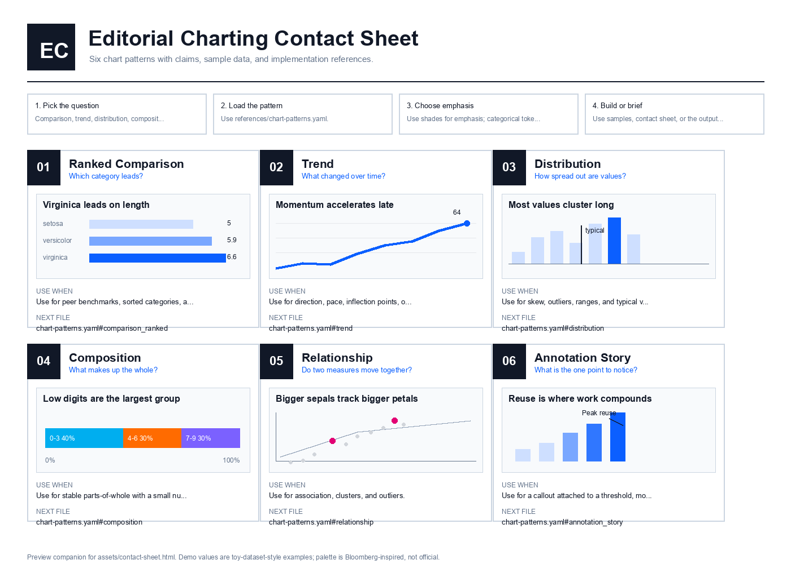

# AI Lab Skills

`codex-ai-lab-skills` is a public skills repository for reusable agent workflows that are concise, auditable, and easy to install from GitHub-based skill loaders.

The public collection focuses on:

- `clear-technical-writing`: rewrite technical and product writing so it sounds concrete, useful, and close to the work
- `design-thinking-simulation`: run a customer-centric design-thinking exercise from opportunity framing through value propositions and story
- `editorial-charting`: specify and prototype editorial charts with a visual contact sheet, color system, and chart-pattern examples
- `planning-packet-workflow`: convert ideas into PRD/ADR/BDD/WTF packets, story/task maps, Linear seeds, agent launch briefs, and optional HTML review notes
- `agent-sprint-lead`: run an agent-led sprint where Codex acts as tech lead, scopes work, delegates sub-agents, verifies outputs, and captures retrospectives
- `success-criteria-designer`: convert vague goals into observable acceptance criteria, non-goals, validation paths, and done conditions
- `agent-tdd-loop`: drive bounded implementation through test-first red/green/repair loops with explicit evidence
- `implementation-verification`: classify completed work or agent runs as Passed, Partial, or Failed against acceptance criteria
- `linear-backlog-grooming`: reconcile Linear backlogs into keep/rewrite/close/create decisions before mutation or delegation
- `agent-backlog-dispatch`: prepare safe tracker candidates for `codex exec`, Symphony, or similar local orchestration runners
- `implementation-comms-log`: write durable Linear comments, changelog notes, PR bodies, validation summaries, and blocker reports
- `trace-to-eval-improvement-loop`: turn failed traces, review feedback, and repeated workflow mistakes into evals or harness improvements

## Repository Layout

- `skills/`: public skill folders
- `.codex-plugin/plugin.json`: Codex plugin manifest for local marketplace-style install
- `.agents/plugins/marketplace.json`: local marketplace entrypoint
- `scripts/validate.sh`: structural validation

## Install In Codex

From a Codex session after cloning this repo locally:

```bash
codex plugin marketplace add ./codex-ai-lab-skills
```

Then install **AI Lab Skills** from the local marketplace.

## GitHub Skill Loaders

This repo is also structured for GitHub-based skill installers that expect standalone skill folders under `skills/<skill-name>/SKILL.md`.

Current public skill slugs:

- `anti-slop-editorial`
- `agent-backlog-dispatch`
- `agent-sprint-lead`
- `agent-tdd-loop`
- `clear-technical-writing`
- `codex-project-planner`
- `design-thinking-simulation`
- `economist-chart-editor` (legacy alias for `editorial-charting`)
- `editorial-charting`
- `evidence-synthesis`
- `instant-influence`
- `implementation-comms-log`
- `implementation-verification`
- `linear-backlog-grooming`
- `planning-packet-workflow`
- `prompt-hardening`
- `python-env-bootstrap`
- `repo-onboarding`
- `success-criteria-designer`
- `trace-to-eval-improvement-loop`

## Skill Notes

### `clear-technical-writing`

Derived from an internal anti-slop editorial draft and refined into a public-safe writing skill. It is aimed at technical blogs, product notes, engineering updates, internal docs, and similar writing that should sound like it came from a practitioner rather than generic AI copy.

### `design-thinking-simulation`

Derived from a design-thinking simulation brief and packaged as a reusable facilitation skill. It produces structured customer scenarios, empathy maps, insight clusters, HMW prompts, value propositions, and a customer story.

### `editorial-charting`

Refreshed from the legacy chart editor into a modular editorial charting skill. It includes a Bloomberg-inspired color system, chart-pattern references, Python examples, and a printable contact sheet.



### ADLC and Agent Workflow Skills

The ADLC skills package a reusable loop for idea intake, planning packets, criteria design, TDD execution, verification, tracker grooming, safe agent dispatch, durable implementation comms, and trace-to-eval improvement. They are public-safe versions of a private operating workflow: no live workspace IDs, private paths, or personal preferences are required. Use `planning-packet-workflow` for artifact packets and `codex-project-planner` for repo scaffolding.

Recommended loop:

```text
planning-packet-workflow
  -> agent-sprint-lead
  -> success-criteria-designer
  -> agent-tdd-loop
  -> implementation-verification
  -> implementation-comms-log
  -> trace-to-eval-improvement-loop
```

In this loop, the human acts as manager or product owner and Codex acts as the sprint lead: it owns scoped delegation, tracker hygiene, verification, and retro capture inside the agreed boundary. The intended plugin split is: visualization skills in one public line, ADLC skills in another public line, and reusable harness core in `CodexSkills`.

## Publishing Notes

- Keep public skill names neutral and discoverable.
- Add repository topics such as `codex`, `skills`, `agent-skills`, `writing`, and `design-thinking` after pushing to GitHub.
- If you later register this repo with an external skills marketplace, keep the skill slugs stable.

## License

MIT
